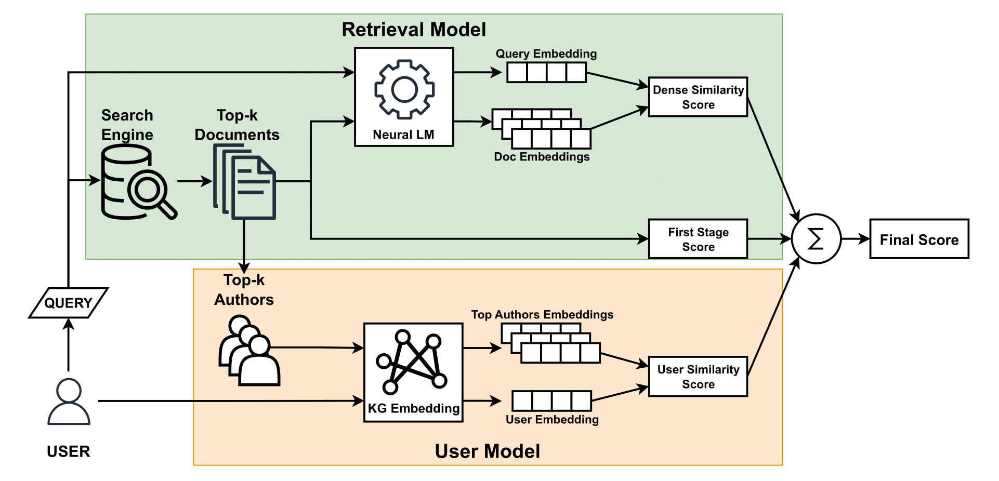
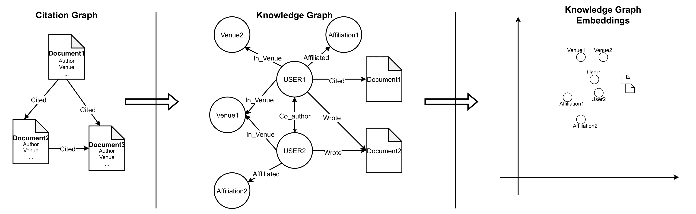

# PARK: Personalized Academic Retrieval with Knowledge-graphs
[Accepted in Information Systems]

Run pipeline.sh to run the full training and testing pipeline
Run ablation.sh to run the ablation studies for the paper

